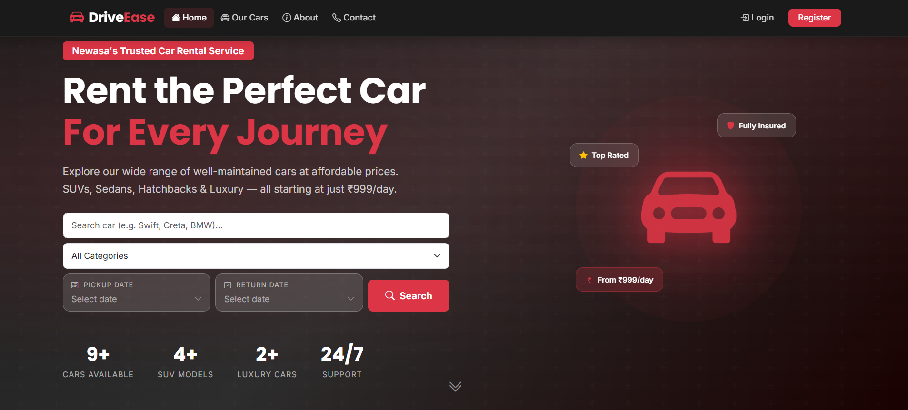
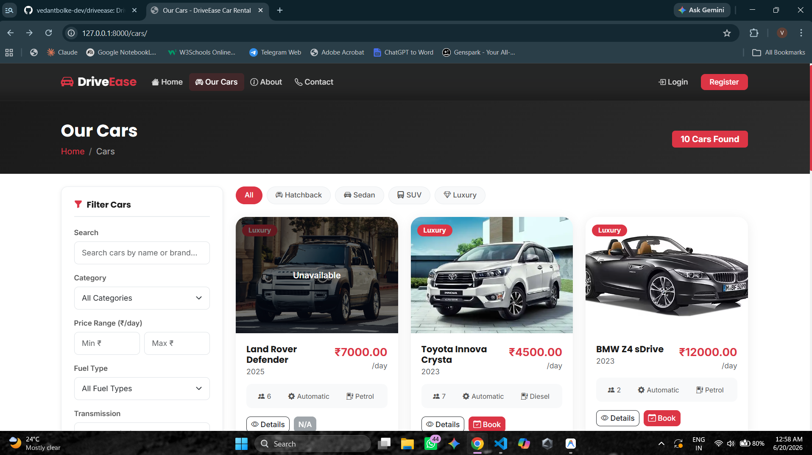
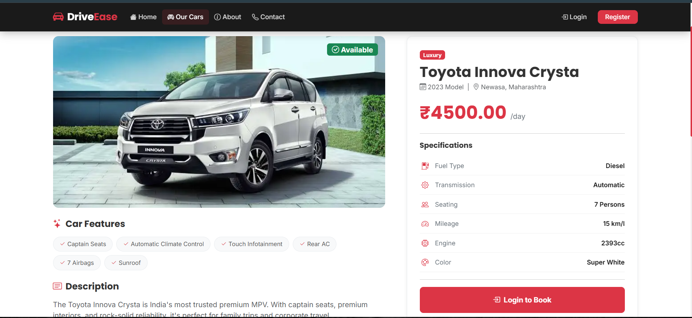
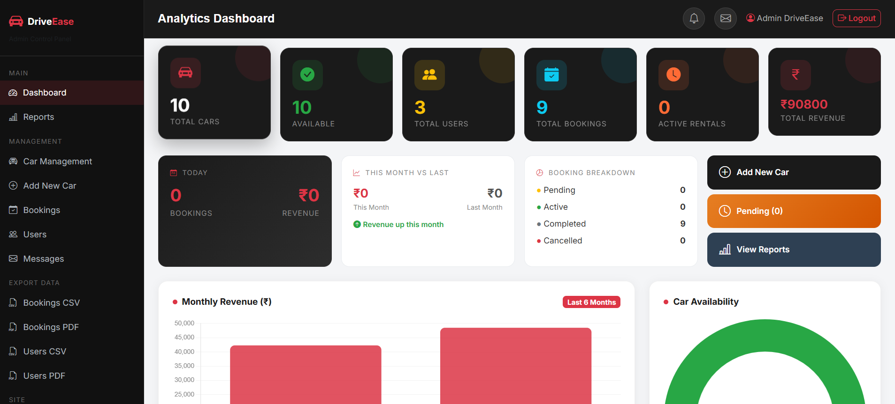
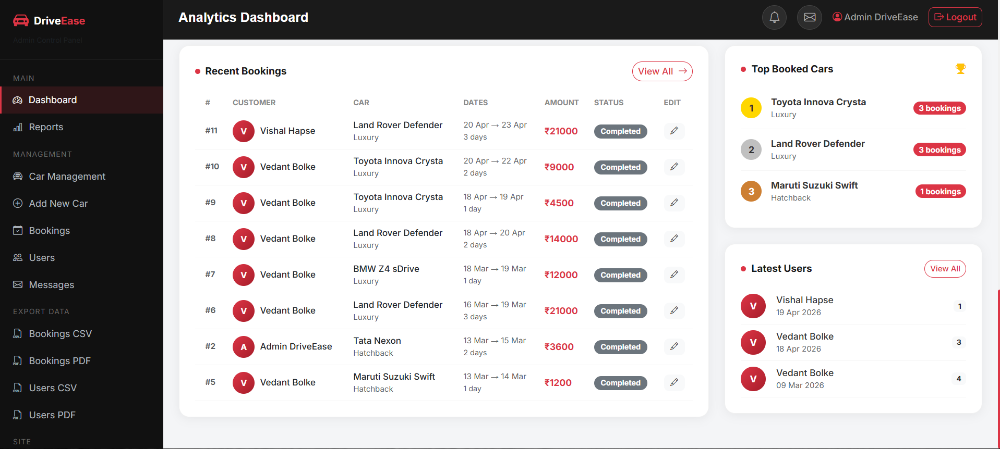
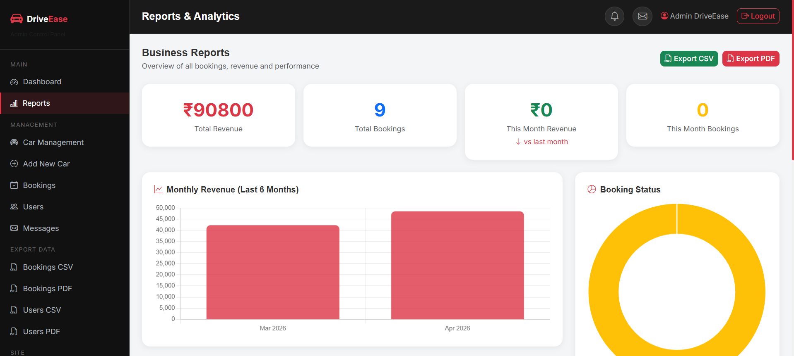
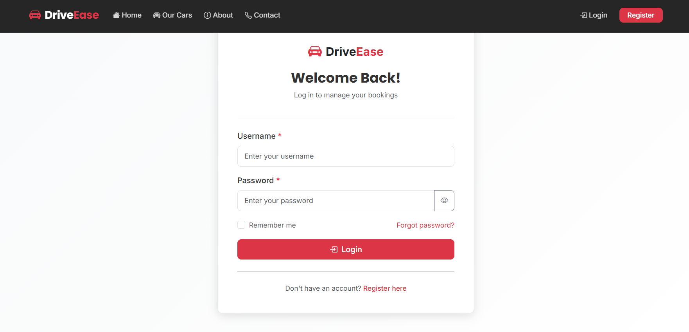

# 🚗 DriveEase — Car Rental Management System

A full-stack web application for managing car rentals with role-based access, real-time booking management, and an analytics dashboard. Built with **Django**, **MySQL**, and **Bootstrap 5**.

> Built by [Vedant Bolke](https://github.com/vedantbolke-dev)

---

## ⚡ Tech Stack


---

## 📸 Screenshots

### 🏠 Customer Portal

#### Homepage


<details>
<summary><b>🔍 View More Customer Pages (Car Listings, Booking, Dashboard)</b></summary>
<br>

#### Car Listings & Search


#### Car Details & Booking


#### User Dashboard

</details>

### 🔧 Admin Dashboard

#### Revenue & Bookings Analytics


<details>
<summary><b>⚙️ View More Admin Pages (Manage Cars, Manage Bookings)</b></summary>
<br>

#### Manage Cars


#### Manage Bookings & Users

</details>

---

## 🎯 Key Features

### 👤 Customer Portal
- **User Authentication** — Register, login, logout with Django's auth system
- **Smart Car Search** — Filter by category, price range, fuel type & transmission
- **Booking System** — Date-based booking with automatic cost calculation
- **Double-Booking Prevention** — Date overlap validation ensures no conflicts
- **Booking Lifecycle** — Track status (Pending → Confirmed → Completed / Cancelled)
- **Profile Management** — Update personal details, upload driving license

### 🔧 Admin Dashboard
- **Revenue Analytics** — Chart.js powered graphs (last 6 months revenue, bookings trend)
- **Car Management** — Full CRUD with image upload & featured car selection
- **Booking Control** — Approve, reject, or complete bookings with admin notes
- **User Management** — Block/unblock users, view user activity
- **Popular Cars Insights** — Data-driven insights on most booked vehicles

---

## 🏗️ Architecture

```
driveease/
├── driveease/              # Django project settings & URL routing
│   ├── settings.py         # Database, auth, static/media config
│   └── urls.py             # Root URL configuration
├── apps/
│   ├── users/              # Custom user model, auth views, profile
│   ├── cars/               # Car model, listings, search & filters
│   ├── bookings/           # Booking model, date validation, invoices
│   └── dashboard/          # Admin analytics, reports, user management
├── templates/              # 25+ Django templates with template inheritance
├── static/                 # CSS, JavaScript, images
└── docs/report-diagrams/   # UML diagrams (Class, ER, Sequence, DFD, Use Case)
```

### Design Decisions
- **Custom User Model** — Extended Django's `AbstractUser` with phone, address, driving license & profile picture fields
- **App-based architecture** — Separated into 4 Django apps for clean separation of concerns
- **Environment-based config** — `python-decouple` for secrets management (no hardcoded credentials)
- **Template inheritance** — Base template with consistent navbar, footer & responsive layout across all pages
- **Management commands** — Custom `seed_data` command to populate demo data

---

## 🗄️ Database Design

Three core models with foreign key relationships:

| Model | Key Fields | Relationships |
|-------|-----------|---------------|
| **CustomUser** | username, email, phone, address, driving_license, is_blocked | — |
| **Car** | name, brand, category, fuel_type, transmission, price_per_day, is_featured | — |
| **Booking** | pickup_date, return_date, total_cost, status, special_requests | FK → User, FK → Car |

> Full ER diagram, class diagram, DFD, and sequence diagrams available in [`docs/report-diagrams/`](docs/report-diagrams/)

---

## 🚀 Setup & Deployment

### 💻 Local Development Setup

To run DriveEase locally:

```bash
# Clone the repo
git clone https://github.com/vedantbolke-dev/driveease.git
cd driveease

# Create virtual environment & install dependencies
python -m venv venv
venv\Scripts\activate        # Windows
# source venv/bin/activate   # macOS/Linux
pip install -r requirements.txt

# Configure environment
copy .env.example .env       # Windows (or use 'cp' on macOS/Linux)
# Open .env and set your MySQL username and password

# Setup database (Create database 'driveease_db' in MySQL first)
python manage.py migrate
python manage.py seed_data   # Creates 9 sample cars + admin account (admin / admin123)

# Run development server
python manage.py runserver   # Visit http://127.0.0.1:8000
```

### 🌐 Live Production Deployment

To host this application live on the web using a free tier server (e.g., PythonAnywhere), refer to the detailed step-by-step guide:

👉 **[PythonAnywhere Deployment Guide](DEPLOYMENT.md)**

---

## 📄 Pages & Routes

| Page | Route | Access |
|------|-------|--------|
| Home (Featured Cars) | `/` | Public |
| Car Listings | `/cars/` | Public |
| Car Details | `/cars/<id>/` | Public |
| Book a Car | `/bookings/create/<id>/` | Logged-in Users |
| User Dashboard | `/users/dashboard/` | Logged-in Users |
| Admin Dashboard | `/dashboard/` | Admin Only |
| Admin — Manage Cars | `/dashboard/cars/` | Admin Only |
| Admin — Manage Bookings | `/dashboard/bookings/` | Admin Only |
| Admin — Manage Users | `/dashboard/users/` | Admin Only |

---

## 📋 What I Learned

- Building a full-stack web app from scratch with Django's MVT architecture
- Designing and normalizing a relational database schema
- Implementing role-based access control (user vs admin)
- Creating reusable Django template components with inheritance
- Building interactive dashboards with Chart.js
- Managing environment variables and secrets securely
- Writing custom Django management commands for data seeding
- Form validation, CSRF protection, and secure file uploads

---

## 📝 License

This project was developed as a final year academic project (B.Sc. Computer Science, 2025–2026).

© 2026 Vedant Bolke
